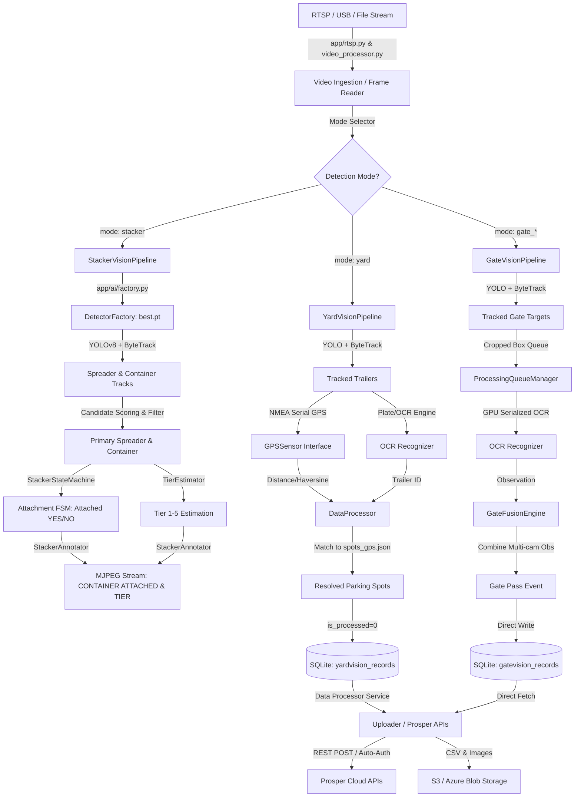

# Trailer Vision Edge - AI EdgeBox Orion (Brain / Runbook)

This document maps out the system architecture, code organization, workflows, data schemas, and resource management strategies of the **Trailer Vision Edge** & **Stacker Vision** application.

---

## 1. System Architecture & Core Concept

**Trailer Vision Edge & Stacker Vision** is a production-ready edge application optimized for **NVIDIA Jetson Orin** (using JetPack) and x86 GPU edge devices. Its purpose is to ingest live video feeds of vehicle/trailer/reach-stacker activity, track objects, perform real-time state machine estimation (Container Attachment & Tier Level), run OCR to extract trailer IDs, resolve locations (GPS & parking spots), and synchronize events with cloud systems (specifically **Prosper Smart Yard**).

---

## 2. Main Workflows

The application handles frame routing and analysis through three primary workflows: **Yard Vision**, **Gate Vision**, and **Stacker Vision**.

### 2.1 Camera & Video Ingestion
* **Source**: Streams are ingested from RTSP URLs, USB cameras (configured via [config/cameras.yaml](file:///d:/ai-video-based-inventory/ai-video-based-inventory/config/cameras.yaml)), or uploaded video files.
* **Implementation**: Core ingestion is located in [app/rtsp.py](file:///d:/ai-video-based-inventory/ai-video-based-inventory/app/rtsp.py) and [app/video_processor.py](file:///d:/ai-video-based-inventory/ai-video-based-inventory/app/video_processor.py).

### 2.2 Detector Loading & AI Factory
* Class: [get_detector](file:///d:/ai-video-based-inventory/ai-video-based-inventory/app/ai/factory.py)
* Centralized detector factory. When `detection_mode = 'stacker'`, it automatically checks for the custom fine-tuned model at `runs/detect/stacker_detector/weights/best.pt` (trained on `PCONTAINER` and `SPREADER` classes with **98.0% mAP50**) and loads `YOLOv8Detector` with `target_class=None`. Falls back gracefully to standard detectors for trailer/car modes.

### 2.3 Stacker Vision Pipeline (Real-Time State & Tier Engine)
* Class: [StackerVisionPipeline](file:///d:/ai-video-based-inventory/ai-video-based-inventory/app/pipelines/stacker_vision_pipeline.py)
* Tailored for Reach Stacker cabin camera feeds:
  1. **Detection & Primary Scoring**: Runs YOLOv8 and ByteTrack. Filters out side hydraulic arm false positives by scoring candidate spreaders near the top-center of the frame and matching attached containers directly below the spreader.
  2. **Attachment Evaluation**: [StackerStateMachine](file:///d:/ai-video-based-inventory/ai-video-based-inventory/app/ai/stacker_state_machine.py) evaluates horizontal alignment and vertical contiguity between spreader and container.
  3. **Tier Estimation**: [TierEstimator](file:///d:/ai-video-based-inventory/ai-video-based-inventory/app/ai/tier_estimator.py) measures spreader/container height relative to cabin hood thresholds to output `Tier 1` through `Tier 5`. Includes fallback estimation from spreader height when container bbox is absent.
  4. **5-Frame Rolling Majority Smoothing**: Smooths attachment (`CONTAINER ATTACHED: YES/NO`) and tier outputs over a 5-frame rolling window to eliminate single-frame glitches.
  5. **No OCR Overhead**: Skips OCR post-processing completely in Stacker mode for continuous, low-latency execution.
  6. **FPS Rate Throttling**: Processing loop throttles to match the recorded video FPS (`1.0 / video_fps`) for smooth, 1.0x real-time playback.

### 2.4 Yard Vision Pipeline
* Class: [YardVisionPipeline](file:///d:/ai-video-based-inventory/ai-video-based-inventory/app/pipelines/yard_pipeline.py)
* Runs trailer frame processing: YOLO detection, ByteTrack tracking, OCR extraction, serial GPS reading, spot resolution via `spots_gps.json`, and SQLite DB storage.

### 2.5 Gate Vision Pipeline
* Class: [GateVisionPipeline](file:///d:/ai-video-based-inventory/ai-video-based-inventory/app/pipelines/gate_pipeline.py)
* Runs multi-camera gate entry/exit lane fusion: crop generation, GPU-serialized OCR queueing, camera observation fusion (`gate_front` / `gate_rear`), and direct SQLite gate event storage.

---

## 3. Database Architecture (SQLite)

Managed by [VideoFrameDB](file:///d:/ai-video-based-inventory/ai-video-based-inventory/app/video_frame_db.py) (`data/video_frames.db`):

1. **`yardvision_records`**: Location records from yard cameras. Resolved by [DataProcessorService](file:///d:/ai-video-based-inventory/ai-video-based-inventory/app/data_processor_service.py) and uploaded to Prosper APIs.
2. **`gatevision_records`**: Gate-pass event records. Synchronized directly to Prosper Gate Event APIs.

---

## 4. GPU Resource Scheduling & Threading

* **Flask Multi-Threading (`threaded=True`)**: [metrics_server.py](file:///d:/ai-video-based-inventory/ai-video-based-inventory/app/metrics_server.py) executes Flask server with `threaded=True`, ensuring MJPEG streaming generator threads do not block API status polling requests.
* **Workload Serialization**: A shared CPU/GPU lock in [ProcessingQueueManager](file:///d:/ai-video-based-inventory/ai-video-based-inventory/app/processing_queue.py) ensures OCR inference and video ingestion do not collide.
* **Deferred Mode (`defer_ocr=True`)**: Saves image crops to disk during video ingestion and runs OCR in an automated batch phase after video ingestion completes.

---

## 5. Model Selection & Hierarchy

### 5.1 Object Detection (YOLO)
* **Stacker Model**: Custom trained YOLOv8m model [`runs/detect/stacker_detector/weights/best.pt`](file:///d:/ai-video-based-inventory/ai-video-based-inventory/runs/detect/stacker_detector/weights/best.pt) (Classes: `0 = PCONTAINER`, `1 = SPREADER`, **98.0% mAP50**, **100% container recall**).
* **Trailer/Car Detector**: TensorRT engine (`models/trailer_detector.engine`) or standard PyTorch `yolov8m.pt`.

### 5.2 OCR Recognition & Preprocessing
* **oLmOCR (Qwen-VL)** / **EasyOCR**: Extracted crops are upscaled (`cv2.INTER_CUBIC`), scanned sequentially (with 90° rotation passes for vertical text columns), and parsed with candidate scoring to filter out model suffixes (e.g. `3000R`, `Thermo King`).

---

## 6. Directory Map

* [app/](file:///d:/ai-video-based-inventory/ai-video-based-inventory/app/) - Core Application Files
  * [main_trt_demo.py](file:///d:/ai-video-based-inventory/ai-video-based-inventory/app/main_trt_demo.py) - Application entrypoint.
  * [metrics_server.py](file:///d:/ai-video-based-inventory/ai-video-based-inventory/app/metrics_server.py) - Flask web server, REST APIs, and MJPEG stream generator.
  * [video_processor.py](file:///d:/ai-video-based-inventory/ai-video-based-inventory/app/video_processor.py) - Video file runner & frame queue manager.
  * [ai/](file:///d:/ai-video-based-inventory/ai-video-based-inventory/app/ai/) - AI modules:
    * [factory.py](file:///d:/ai-video-based-inventory/ai-video-based-inventory/app/ai/factory.py) - Centralized AI detector loader.
    * [detector_yolov8.py](file:///d:/ai-video-based-inventory/ai-video-based-inventory/app/ai/detector_yolov8.py) - YOLOv8 wrapper.
    * [stacker_state_machine.py](file:///d:/ai-video-based-inventory/ai-video-based-inventory/app/ai/stacker_state_machine.py) - Reach Stacker attachment FSM.
    * [tier_estimator.py](file:///d:/ai-video-based-inventory/ai-video-based-inventory/app/ai/tier_estimator.py) - Container tier height estimator.
    * [stacker_annotator.py](file:///d:/ai-video-based-inventory/ai-video-based-inventory/app/ai/stacker_annotator.py) - Overlay graphics renderer (`CONTAINER ATTACHED: YES/NO`, `TIER`).
    * [tracker_bytetrack.py](file:///d:/ai-video-based-inventory/ai-video-based-inventory/app/ai/tracker_bytetrack.py) - Multi-object ByteTrack tracker.
  * [pipelines/](file:///d:/ai-video-based-inventory/ai-video-based-inventory/app/pipelines/) - Vision routing modules:
    * [stacker_vision_pipeline.py](file:///d:/ai-video-based-inventory/ai-video-based-inventory/app/pipelines/stacker_vision_pipeline.py) - Reach Stacker pipeline.
    * [yard_pipeline.py](file:///d:/ai-video-based-inventory/ai-video-based-inventory/app/pipelines/yard_pipeline.py) - Yard location pipeline.
    * [gate_pipeline.py](file:///d:/ai-video-based-inventory/ai-video-based-inventory/app/pipelines/gate_pipeline.py) - Gate entry/exit pipeline.
  * [ocr/](file:///d:/ai-video-based-inventory/ai-video-based-inventory/app/ocr/) - OCR adapters (`olmocr_recognizer.py`, `easyocr_recognizer.py`, `batch_ocr_processor.py`).
* [config/](file:///d:/ai-video-based-inventory/ai-video-based-inventory/config/) - Configuration files (`cameras.yaml`, `trailer_dataset.yaml`).
* [models/](file:///d:/ai-video-based-inventory/ai-video-based-inventory/models/) - Contains compiled TensorRT engines.
* [runs/detect/stacker_detector/weights/](file:///d:/ai-video-based-inventory/ai-video-based-inventory/runs/detect/stacker_detector/weights/) - Custom trained Stacker YOLO model (`best.pt`).
* [train_stacker_model.py](file:///d:/ai-video-based-inventory/ai-video-based-inventory/train_stacker_model.py) - Training script for Stacker YOLO model.

---

## 7. Common Environment Configurations

| Env Variable | Example Value | Description |
| :--- | :--- | :--- |
| `DETECTION_MODE` | `stacker` / `trailer` / `car` | Target detection mode for YOLO & vision pipeline. |
| `OCR_MODEL` | `Qwen/Qwen3-VL-4B-Instruct` | HuggingFace model path for oLmOCR. |
| `VIDEO_PROCESSED_FRAMES_CACHE_SIZE` | `200` | Limits memory usage for FIFO frame cache. |
| `PROSPER_API_BASE_URL` | `http://syapi.prosperassettracking.com` | API endpoint for Prosper Cloud. |
