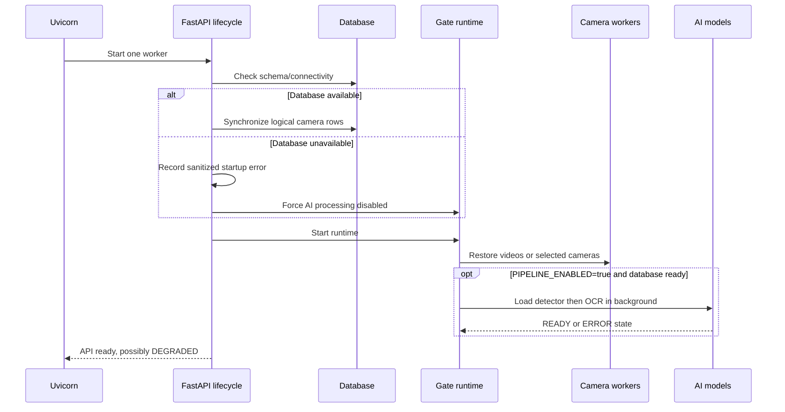

# GateVision Gate Module — Project Brain

This document is the source of truth for how the active Gate Module is intended to work. It describes the operating model, runtime flow, interfaces, persistence, failure behavior, configuration and deployment boundaries. The former root `app/` Flask application has been retired and removed. The remaining legacy folders are not active dependencies of this module.

## 1. Purpose

GateVision observes container movement at an industrial gate from as many as four logical camera views. Each view can use either:

- a physical IP camera connected through the PoE network and exposed as an RTSP stream; or
- a manually uploaded video used when cameras are unavailable or for repeatable testing.

The module captures frames, detects relevant objects, tracks them across frames, reads container numbers, validates ISO 6346-style identifiers, determines movement direction when calibrated, and writes a gate event with its evidence. The dashboard also exposes input state, event history, CPU/RAM and NVIDIA GPU telemetry.

This is an observation and evidence system. It does not control a physical barrier, guarantee BIC registration, or replace a gate operator's review process.

## 2. Current operating boundaries

- The new backend is FastAPI with one in-process runtime owner.
- The frontend is a standalone Angular application.
- Production persistence is MySQL through SQLAlchemy and PyMySQL.
- SQLite is permitted only as a test double in `DEPLOYMENT_MODE=test`.
- The backend must run with exactly one worker because camera capture, tracking, queues and GPU scheduling are process-local.
- The deployment startup path is one FastAPI process. It also serves the compiled Angular files, so a separate frontend server is not required.
- Development services bind to localhost. No application authentication is implemented yet.
- Site configuration and admin login are intentionally deferred. The UI displays `Not configured` and `Not signed in` rather than inventing values.
- Uploaded-video preview works when MySQL or AI models are unavailable.
- AI event processing requires an initialized MySQL database and successfully loaded detector/OCR models.
- Real camera accuracy, live MySQL behavior and target-edge performance must be measured on the deployment hardware.

## 3. System map

```mermaid
flowchart LR
    POE[PoE IP cameras] -->|RTSP URLs in backend environment| REG[Camera source registry]
    FILE[Uploaded video files] --> LIB[Local video library]
    REG --> SLOT[Four logical input slots]
    LIB --> SLOT
    SLOT --> CAP[Independent capture workers]
    CAP --> LATEST[Latest-frame buffers]
    LATEST --> PREVIEW[JPEG preview API]
    LATEST --> SCHED[Single inference scheduler]
    SCHED --> DET[YOLO detector adapter]
    DET --> TRACK[Per-slot temporal tracker]
    TRACK --> DIR[Direction logic]
    TRACK --> QUEUE[Bounded OCR queue]
    QUEUE --> OCR[OCR engine]
    OCR --> ISO[Container ID validator]
    ISO --> CONFIRM[Repeated-evidence confirmation]
    CONFIRM --> DEDUP[Lane/direction/time deduplication]
    DEDUP --> DB[(MySQL)]
    DEDUP --> SNAP[Snapshot files]
    PREVIEW --> API[FastAPI]
    DB --> API
    API --> UI[Angular operations dashboard]
    METRICS[CPU / RAM / GPU metrics] --> API
```



## 4. Main project areas

### Backend

- `backend/app/main.py` creates the FastAPI application, middleware, routes and lifecycle.
- `backend/app/runtime.py` coordinates inputs, model loading, inference, OCR and event creation.
- `backend/app/config/settings.py` validates environment and YAML configuration.
- `backend/app/camera/` owns RTSP/file decoding, input workers, source selection and uploaded-video assignments.
- `backend/app/detection/` contains detector and tracker boundaries.
- `backend/app/ocr/` contains cropping, OCR and container-number validation.
- `backend/app/events/` contains confirmation, direction and event-association behavior.
- `backend/app/database/` contains schema initialization, ORM models and repositories.
- `backend/app/snapshots/` owns evidence image writes.
- `backend/app/api/` contains the HTTP surface.
- `backend/app/metrics.py` and `backend/app/gpu_metrics.py` collect runtime telemetry.

### Frontend

- `frontend/src/app/app.component.ts` coordinates polling, UI actions and error isolation.
- `frontend/src/app/camera-grid.component.ts` renders four input cards, source dropdowns, uploads and playback controls.
- `frontend/src/app/system-health.component.ts` renders database, model, queue, CPU/RAM and GPU health.
- `frontend/src/app/event-table.component.ts` and `event-detail.component.ts` render event history and evidence.
- `frontend/src/app/gate-api.service.ts` defines typed API contracts.
- `frontend/src/styles.css` contains the responsive visual system.

### Configuration and local state

- `backend/config/cameras.yaml` defines physical source choices and four logical processing slots.
- `backend/.env` contains local secrets and deployment-specific values; it must not be committed.
- `backend/uploads/assignments.json` stores uploaded-video assignments.
- `backend/uploads/camera-selections.json` stores the selected physical source for each slot.
- `backend/snapshots/` stores event evidence images.

## 5. Physical cameras and logical slots

Physical cameras and logical slots are deliberately separate concepts.

A physical camera source has:

- a stable source ID;
- a friendly name shown in dropdowns;
- an environment-variable name containing its RTSP URL; and
- an enabled flag.

A logical slot has:

- a slot ID and display name;
- a gate/lane ID;
- direction or line-crossing calibration;
- capture/inference rates;
- OCR crop settings; and
- an active source, which can be a physical camera or a video file.

This separation allows an operator to route any known PoE camera into any slot without sending the RTSP URL or password to the browser. The slot keeps its lane/direction/ROI semantics while only its media source changes.

### Source dropdown flow

1. The dashboard requests `GET /api/cameras/sources/available`.
2. The backend returns only source ID, friendly name and whether its environment variable is populated.
3. The operator chooses a camera in a slot dropdown.
4. The frontend sends `POST /api/cameras/{slot_id}/source` with the source ID.
5. The runtime locks that slot, stops and joins the previous worker, deactivates manual-video mode, creates a new worker for the chosen RTSP source, resets that slot's tracker and starts capture.
6. The source ID is saved in `camera-selections.json` and restored on the next service start.

`configured=true` means an RTSP environment variable is populated. It does not prove that the camera is reachable. The worker's ONLINE/OFFLINE/RECONNECTING/ERROR state is the connectivity result.

## 6. Manual-video flow

Manual video is a first-class fallback for each slot.

1. The operator chooses or drops MP4, AVI, MOV, MKV, WEBM or M4V footage on a slot.
2. Angular checks the extension and configured size limit before sending.
3. The browser streams the raw file body to `POST /api/cameras/{slot_id}/video` with a URL-encoded `X-Filename` header.
4. The backend streams the body to a random internal filename and enforces the size limit while receiving it.
5. OpenCV must open the file and decode at least one frame. Empty, oversized, unsupported or unreadable files are removed and rejected.
6. A replacement worker decodes the first frame for preview and enters READY; playback does not start automatically.
7. Play starts server-side, FPS-paced decoding. Pause freezes the worker, Restart builds a fresh source generation, and Play all starts every file-backed slot.
8. Use camera restores the physical camera selected in the slot dropdown.

Uploads survive service restarts and return in READY state. Replaced or deactivated files are retained; no automatic retention/deletion policy exists. Preview is periodically refreshed JPEG without audio and is not synchronized forensic playback across cameras.

## 7. Service startup flow



Database failure does not terminate the API. Camera cards, dropdowns, uploads, previews and machine metrics remain usable. Event endpoints return a sanitized database-unavailable response, and the UI isolates that error from the rest of the dashboard.

## 8. Capture and frame handling

Each slot owns one `CameraWorker` thread. Workers independently open, read and reconnect so a broken source does not block the other slots.

- Live RTSP failures use bounded open/read timeouts and exponential reconnect backoff.
- File sources are paced using recorded FPS and report completion at EOF.
- Each worker holds only a latest preview and one pending inference frame.
- Replacing an unread pending frame increments the dropped-frame count instead of building latency.
- Oversized frames are aspect-ratio resized to `MAX_FRAME_WIDTH` before publication.
- Every installed source has a new random `source_id` generation.
- A frame carries slot ID, UTC timestamp, sequence, pixels and source generation.

The source generation is important: inference/OCR work queued from an old camera or old video is discarded after a slot changes source. This prevents evidence from being attached to the replacement input.

## 9. AI processing flow

### Scheduling

There is one inference scheduler for all slots and one bounded OCR queue. A shared accelerator lock prevents concurrent detector and OCR use of the same GPU context. This favors predictable resource use over maximum parallel throughput.

For each eligible frame:

1. Enforce the slot/global inference FPS and frame-skip rules.
2. Run the detector once.
3. Retain recent detections in a bounded in-memory list for diagnostics.
4. Update that slot's class-aware IoU tracker.
5. Wait for the minimum track hit count.
6. Determine ENTRY, EXIT or UNKNOWN.
7. If the tracked object class is OCR-eligible, enqueue one OCR job subject to the per-track interval and queue capacity.

### Detector

The `Detector` interface isolates model implementation. The current Ultralytics adapter accepts explicit PyTorch `.pt`, ONNX `.onnx` or TensorRT `.engine` configuration. The service never silently downloads a replacement checkpoint or substitutes synthetic results.

Model class names must be verified against the actual checkpoint. Aliases are configuration, not evidence that similarly named training labels mean the same physical object.

### Tracking and direction

The current tracker is a proof-of-concept, class-aware IoU tracker with time-based expiry. It is local to each view and does not perform cross-camera person/object re-identification.

Direction is one of:

- fixed ENTRY or EXIT for a calibrated unidirectional view;
- a result from crossing a configured normalized x/y line and deadband; or
- UNKNOWN when direction is not safely determined.

Camera position names do not imply direction. Line placement and positive-crossing orientation must be calibrated with site footage.

### OCR and ISO validation

OCR operates on a configurable normalized sub-region inside a detected container/trailer box, with the whole box as the default. The crop is clipped to image bounds before reading.

Validation preserves raw OCR text and creates a normalized candidate. A trusted container ID requires:

- three owner-code letters;
- equipment category U, J or Z;
- six serial digits;
- one check digit; and
- a valid calculated check digit.

Ambiguous multiple identifiers and guessed O/0 replacements are rejected. Valid text must be independently confirmed across the configured number of observations. Exhausted invalid/insufficient reads create NEEDS_REVIEW evidence without a trusted container number.

## 10. Event creation and deduplication

An OCR job produces an observation containing the origin key, lane, track, detection, validation, direction, image and timing.

The origin key includes service run, slot, source generation and track ID. SQL uniqueness makes retries idempotent. A track is considered complete only after its database transaction succeeds.

For a confirmed container identity, the repository looks for an event with the same:

- gate/lane;
- normalized container number;
- direction; and
- timestamp inside `DEDUP_SECONDS`.

If found, the new camera/track evidence is associated with that event. Otherwise a new event is created. Different container identities are never combined merely because they occurred close together. UNKNOWN and known directions remain distinct.

Invalid reads stay local to their track and create NEEDS_REVIEW events; they are not safely fused across views. Repeated real visits inside the dedup window can merge, while fragmented tracks outside it can duplicate. Tune this using site acceptance data.

## 11. Atomic evidence persistence

Schema version 1 contains:

| Table | Purpose |
|---|---|
| `gate_schema_version` | Explicit schema compatibility marker |
| `cameras` | Logical slot metadata and sanitized configuration |
| `gate_events` | Lane-level movement event and confirmed/review status |
| `detections` | Per-source track evidence, class, confidence and bounding box |
| `ocr_results` | Raw/normalized text, confidence and validation flags |
| `snapshots` | Database reference to evidence JPEG |
| `system_logs` | Structured event audit records without source credentials |

Event, detection, OCR, snapshot metadata and audit row are committed in one SQL transaction. A snapshot is first written through a temporary path and renamed. If the SQL transaction fails, the new JPEG is removed. A process crash between filesystem write and SQL commit can still leave an orphan file, so maintenance must reconcile snapshot files with the database.

Database write failures keep the active OCR observation in memory and retry while the process is alive. The queues are not a durable outbox; power loss or process termination can lose uncommitted work.

## 12. API contract

### Inputs

| Method | Path | Purpose |
|---|---|---|
| GET | `/api/cameras` | All logical slots, active source and worker/playback state |
| GET | `/api/cameras/sources/available` | Sanitized source dropdown choices |
| POST | `/api/cameras/{id}/source` | Select a physical camera for a slot |
| GET | `/api/cameras/{id}/status` | One slot's worker state |
| POST | `/api/cameras/{id}/test` | Attempt one frame from the active source |
| GET | `/api/cameras/{id}/frame` | Latest resized JPEG preview with no-store caching |
| POST | `/api/cameras/{id}/video` | Stream and install an uploaded video |
| POST | `/api/cameras/{id}/playback` | Play, pause, restart or restore-camera |
| POST | `/api/videos/play-all` | Start all installed videos |
| POST | `/api/processing/start` | Recheck MySQL and begin AI model loading |

### Events and evidence

| Method | Path | Purpose |
|---|---|---|
| GET | `/api/gate-events` | Paginated events with exact container, camera, type and status filters |
| GET | `/api/gate-events/{id}` | Event with detection, OCR and snapshot evidence |
| GET | `/api/detections` | Recent transient or stored detection view, as implemented |
| GET | `/api/ocr-results` | Recent stored OCR results |
| GET | `/api/snapshots/{id}` | Evidence image by database ID |

### Operations

| Method | Path | Purpose |
|---|---|---|
| GET | `/api/health` | READY or DEGRADED system state |
| GET | `/api/models` | Detector/OCR loading and error state plus configured backend |
| GET | `/api/metrics` | FPS, counters, latency, queues, CPU/RAM/process memory and GPU readings |

All error bodies are sanitized. Source URLs and credentials are excluded from APIs and structured logs.

## 13. Health and telemetry

The UI polls operational data every 2.5 seconds and refreshes preview URLs every second.

Health reports:

- database READY/UNAVAILABLE;
- pipeline enabled/disabled;
- detector and OCR state;
- configured/online slot counts;
- model/processing/startup error type; and
- upload-size limit.

Metrics report:

- capture FPS per worker;
- inference FPS per slot;
- dropped/skipped/error/event counters;
- inference/OCR/end-to-end latency samples with p50/p95;
- OCR queue depth;
- CPU, system memory and process memory; and
- GPU name, utilization, power draw, power limit, temperature and VRAM when supported.

NVIDIA GPU values come from a bounded, cached `nvidia-smi` query. Unsupported fields remain null and the UI shows unavailable rather than inventing a reading. Jetson deployments without compatible `nvidia-smi` need a platform metrics adapter such as a reviewed tegrastats integration.

## 14. Dashboard behavior

The dashboard has four independent camera cards plus system health and recent events.

Each camera card shows:

- logical view number, name, lane and direction;
- ONLINE/OFFLINE/RECONNECTING/ERROR or file playback state;
- camera-source dropdown;
- live or recorded latest-frame preview;
- drag/drop and Add/Replace video control;
- upload progress and validation errors;
- per-video Play/Pause/Restart/Use camera controls; and
- capture FPS, inference FPS and dropped frames.

The system panel shows database/model states, OCR queue, CPU/RAM and GPU telemetry. The event area supports exact container search, movement filter, pagination and evidence details. Database event errors are displayed locally and do not hide input or health controls.

Responsive behavior keeps a two-by-two camera grid on wider screens and moves health/cards into narrower layouts at configured breakpoints.

## 15. Configuration reference

Core settings are environment driven:

- `DATABASE_URL`: new MySQL database connection.
- `CAMERAS_FILE`: path to YAML source/slot definitions.
- `CAMERA_1_RTSP` … `CAMERA_4_RTSP`: example RTSP secret variables.
- `PIPELINE_ENABLED`: enable AI loading at startup.
- `MODEL_BACKEND`, `MODEL_PATH`, `MODEL_DEVICE`, `MODEL_IMAGE_SIZE`.
- `TARGET_CLASSES`, `CLASS_ALIASES`, `OCR_CLASSES`.
- `OCR_ENGINE`, `OCR_GPU`, `OCR_DOWNLOAD_ENABLED`, `OCR_MODEL_DIRECTORY`.
- `INFERENCE_FPS`, `CONFIDENCE_THRESHOLD`, `OCR_MIN_CONFIDENCE`.
- `MIN_TRACK_HITS`, `OCR_CONFIRMATIONS`, `OCR_MAX_ATTEMPTS`, `OCR_INTERVAL_SECONDS`.
- `OCR_QUEUE_SIZE`, `DEDUP_SECONDS`, `TRACK_TTL_SECONDS`.
- `SNAPSHOT_DIRECTORY`, `UPLOAD_DIRECTORY`, `MAX_UPLOAD_MB`.
- `CORS_ORIGINS` and capture open/read/reconnect/frame-width limits.

RTSP credentials belong only in `.env` or the deployment's secret store. YAML refers to the environment-variable name. Never place live passwords in frontend code, API payloads, logs or committed configuration.

## 16. Failure behavior

| Failure | Expected behavior |
|---|---|
| Camera URL missing | Source shown as not configured; slot remains OFFLINE |
| Camera unreachable/read failure | Worker reports error/reconnecting with exponential backoff; other slots continue |
| Source switched | Old worker stops; tracker resets; stale source-generation jobs are discarded |
| Invalid upload | Request rejected and partial file removed; previous active source remains intact |
| Video EOF | Last preview remains; state becomes COMPLETED; Restart is available |
| MySQL unavailable at startup | API runs DEGRADED; AI disabled; inputs/uploads/previews/metrics remain available |
| MySQL write fails during event | Current observation retries in memory; health/metrics expose processing failure |
| Detector/OCR load failure | Model state becomes ERROR; API and video operation continue |
| OCR queue full | New job is dropped and a metric increments; capture remains current |
| GPU telemetry unsupported | GPU fields are null and UI displays unavailable |
| Worker fails to stop in time | Source replacement returns conflict; operator retries after shutdown |

## 17. Security and operational controls

- Backend and frontend default to loopback development access.
- CORS permits configured frontend origins.
- Mutating browser requests with an unexpected `Origin` are rejected.
- Origin checks are not user authentication or authorization.
- Production exposure requires an authenticated TLS reverse proxy, user roles, network policy and audit requirements.
- Uploaded filenames are sanitized; server filenames are random; traversal outside the upload root is rejected.
- Upload extension, length and actual decoder readability are validated.
- API responses and logs do not include RTSP URLs.
- MySQL schema initialization is explicit and does not drop legacy tables.
- No automatic snapshot/upload retention currently runs; disk capacity and removal policy are operator responsibilities.

## 18. Development and verification

### Normal Windows startup

From the project root:

```powershell
.\start.ps1
```

This one command starts the UI, API, input workers and AI runtime at `http://127.0.0.1:8001`. It builds Angular only if the compiled UI is missing. Use `./start.ps1 -BuildFrontend` after frontend changes. Binding to `0.0.0.0` is available through `-HostAddress 0.0.0.0`, but requires deployment authentication, TLS and network controls before untrusted exposure.

### Component development

From `backend`:

```powershell
.\.venv\Scripts\python -m app.database.initialize
.\.venv\Scripts\python -m uvicorn app.main:app --host 127.0.0.1 --port 8001 --workers 1 --no-access-log
.\.venv\Scripts\python -m pytest -q
```

From `frontend`:

```powershell
npm ci
npm start
npm run build
```

The Angular development proxy forwards `/api` to `127.0.0.1:8001`. Open `http://127.0.0.1:4200`. OpenAPI is available at `http://127.0.0.1:8001/docs`.

`python -m tools.simulate --serve` provides explicitly marked synthetic events for hardware-free UI smoke testing. It is not real AI output. Recorded-video tests use actual OpenCV decoding. The MySQL integration suite requires a disposable `gate_test_<suffix>` database through `TEST_MYSQL_URL` and otherwise skips.

## 19. Site acceptance checklist

Before production acceptance, verify:

1. Every PoE camera's IP, RTSP path, credentials, codec and network reachability.
2. Every dropdown source maps to the intended physical camera.
3. Four simultaneous streams over a sustained run, including unplug/reconnect cases.
4. Lane IDs and ENTRY/EXIT calibration against actual vehicle movement.
5. Detector classes against the exact deployed checkpoint metadata.
6. OCR visibility across daylight, darkness, rain, glare, dirt, angle and motion blur.
7. Exact container-number rate and NEEDS_REVIEW rate on unseen site footage.
8. Missed-event, duplicate-event and cross-view association rates.
9. CPU, GPU, memory, queue depth, dropped frames, disk growth and p50/p95 latency.
10. MySQL backup/restore, service supervision, power-loss behavior and restart recovery.
11. Snapshot/upload retention and orphan-file reconciliation.
12. Authentication, authorization, TLS, network segmentation and audit policy before non-loopback exposure.

## 20. Known limitations and next hardening phases

- No login, role-based access, site-management workflow or multi-site tenancy yet.
- No automatic camera discovery or ONVIF provisioning. Sources are explicitly registered and use known RTSP URLs.
- The IoU tracker is not sufficient for all long occlusions or complex traffic.
- Cross-camera association relies on confirmed container identity plus lane/direction/time, not visual re-identification.
- No durable event outbox exists for database outages or power loss.
- No automatic upload/snapshot lifecycle management exists.
- No synchronized multi-camera replay clock or recorded-timestamp extraction exists.
- Preview is periodic JPEG, not WebRTC, and does not carry audio.
- No dedicated container-text localization model is included.
- TensorRT/Jetson packages, engine compatibility and throughput must be validated on the target device.
- Real model accuracy and performance are not established by unit tests.
- Schema changes require reviewed versioned migrations; the initializer is not a migration engine.

Recommended progression:

1. Connect and calibrate physical cameras and collect representative site footage.
2. Validate/iterate the detector and OCR pipeline using held-out data.
3. Run disposable MySQL integration and sustained four-stream soak tests.
4. Add durable outbox, retention/reconciliation jobs and operational alerting.
5. Add authenticated site/admin management before network exposure.
6. Optimize decode/inference for the selected edge hardware only after measurement.

## 21. Definition of a successful gate event

A confirmed production event is successful when:

- the correct physical source was active in the intended logical lane slot;
- a relevant object was detected and tracked with sufficient evidence;
- direction was correctly calibrated or honestly remained UNKNOWN;
- OCR produced a non-ambiguous, check-digit-valid container number with repeated confirmation;
- deduplication created or associated the correct lane passage;
- detection, OCR and snapshot evidence committed together;
- the event is visible and reviewable in the dashboard; and
- no credential, fabricated identity or stale-source evidence entered the record.

When these conditions cannot be met, the system should fail visibly and conservatively—OFFLINE, DEGRADED, ERROR or NEEDS_REVIEW—while preserving independent operation where it is safe to do so.
